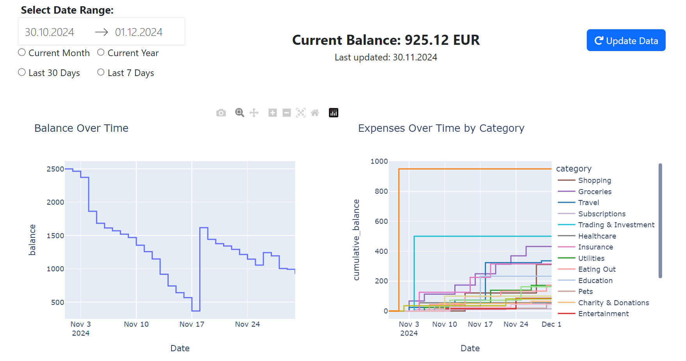
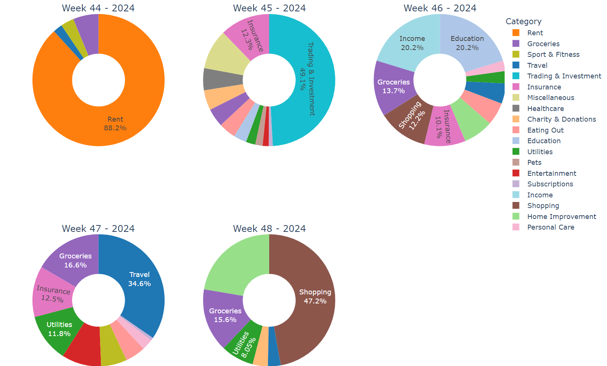

# DKB Transactions Dashboard

A interactive dashboard built with Plotly Dash for visualizing bank transaction data and expenses. This tool helps users track their bank balances, visualize expenses, and categorize transactions based on keywords. It connects to the DKB bank API for transaction data retrieval.

> **Note:** This project was built as a **quick and dirty** solution, with a focus on rapid development rather than polished code structure or comprehensive testing. While functional, it may contain rough edges or areas for improvement.

## Features

- **Balance and Expenses Visualization**:

  - Line plots for tracking balance changes over time.
    
  - Pie charts to show spending distribution across categories.
    

- **API Integration**:

  - Connects to the DKB bank API for updating transaction data.
  - Username, password and 2-factor-authentication are required

- **Expense Categorization**:
  - A simple categorization module that classifies transactions based on keywords.

## Components

The repository is organized into three main modules:

1. **UI**:
   - Contains the interactive dashboard elements built with Plotly Dash.
   - Visualizations include balance over time (line plots) expense breakdown (pie charts) and a transaction table.
2. **API Module**:
   - Manages API requests to DKB bank, retrieves transaction data for visualization.
   - Handles API authentication and error handling.
3. **Categorization Module**:
   - Classifies expenses into categories based on keywords.
   - Users can add or adjust keywords to refine classification.

## Getting Started

1. **Clone the Repository**:

   ```bash
   git clone https://github.com/julianhay/dkb-transactions-dashboard.git
   cd bank-transactions-dashboard

   ```

2. **Install Dependencies**:

   ```bash
   pip install -r requirements.txt

   ```

3. **Run the Dashboard**:
   ```bash
   python app.py
   ```

## File Structure

    .
    ├── app.py                    # Main script to run the Dash app
    ├── requirements.txt          # Python dependencies
    ├── README.md                 # Project documentation
    ├── ui/                       # Contains UI components (balance plots, pie charts)
    ├── api/                      # Contains API module to connect to DKB bank
    └── categorization/           # Contains categorization module for transactions

## Future Improvements

    - Advanced categorization based on machine learning models.
    - Improved API integration for more banks and financial institutions.
    - User customization for additional visualizations and filters.

## License

This project is licensed under the MIT License.
